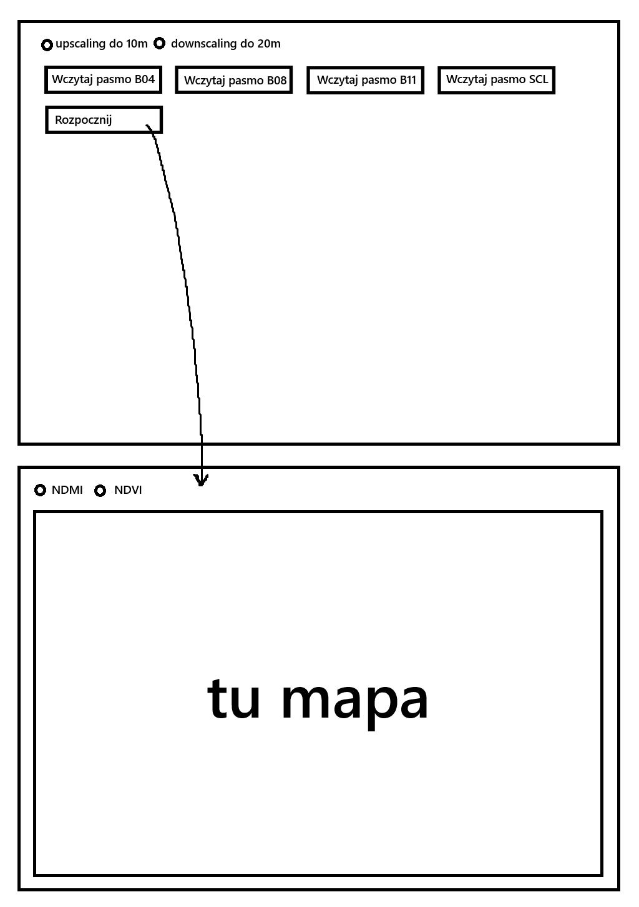

# Specyfikacja Projektowa: System Analizy Indeksów Roślinności Sentinel-2

## Wprowadzenie

Projekt obejmuje implementację aplikacji w języku C, wykorzystującej przetwarzanie równoległe do efektywnego obliczania indeksów NDMI (Znormalizowany Różnicowy Wskaźnik Wilgotności) oraz NDVI (Znormalizowany Różnicowy Wskaźnik Wegetacji).

## Cel Projektu

Głównym celem projektu jest stworzenie programu do:
* Wczytywania i wstępnego przetwarzania wymaganych pasm satelitarnych Sentinel-2 (B4, B8, B11) oraz warstwy klasyfikacji sceny (SCL).
* Implementacji równoległego resamplingu danych do wspólnej rozdzielczości (10m lub 20m).
* Zastosowania maski SCL do identyfikacji i wykluczenia niepożądanych pikseli (np. chmury, cienie, woda) z obliczeń.
* Równoległego obliczania wskaźników NDVI i NDMI.
* Prezentacji wyników w formie map w interfejsie graficznym.

## Technologie

* **Język programowania:** C
* **Przetwarzanie równoległe:** OpenMP/MPI
* **Przetwarzanie obrazów:** Biblioteka GDAL
* **GUI:** GTK

## Główne Funkcje Aplikacji

1.  **Wczytywanie Danych Produktu Sentinel-2:**
    * Użytkownik wybiera w GUI następujące pliki:
        * B4 (RED, 10m)
        * B8 (NIR, 10m)
        * B11 (SWIR1, 20m)
        * SCL (Scene Classification Layer, 20m)
2.  **Przetwarzanie Wstępne Danych:**
    * **Resampling:**
        * Równoległy resampling w dół lub w górę, w zależności od wyboru użytkownika
    * **Maskowanie:**
        * Wykorzystanie warstwy SCL (po resamplingu do docelowej rozdzielczości).
        * Piksele zidentyfikowane jako nieprawidłowe zostaną wykluczone z dalszych obliczeń wskaźników (otrzymają wartość NoData).
3.  **Obliczanie Wskaźników:**
    * Równoległe obliczanie wskaźnika NDVI i NDMI
4.  **Wizualizacja Wyników:**
    * Równoległe mapowanie wartości współczynników na kolor.
    * Wyświetlenie wynikowych map NDVI i NDMI w GUI.
    * Możliwość przełączania się między wyświetlanymi mapami.


## Dane Wejściowe

* Program operuje na 4 plikach `.jp2` dla pasm:
    * **Pasmo 4 (RED):** np. `T34UFD_YYYYMMDDTHHMMSS_B04_10m.jp2`
    * **Pasmo 8 (NIR):** np. `T34UFD_YYYYMMDDTHHMMSS_B08_10m.jp2`
    * **Pasmo 11 (SWIR1):** np. `T34UFD_YYYYMMDDTHHMMSS_B11_20m.jp2`
    * **Warstwa Klasyfikacji Sceny (SCL):** np. `T34UFD_YYYYMMDDTHHMMSS_SCL_20m.jp2`

## Przetwarzanie równoległe
* Wykorzystane zostanie przetwarzanie domenowe dla upscalingu, downscalingu, obliczania NDVI oraz NDMI, ponieważ wszystkie piksele są od siebie niezależne.
* Równoległe mapowanie wartości współczynników na kolor, ponieważ każda wartość jest od siebie niezależna.

## Kluczowe Algorytmy i Wzory

* **Wzory obliczeniowe:**
    * `NDVI = (NIR - RED) / (NIR + RED)`
    * `NDMI = (NIR - SWIR1) / (NIR + SWIR1)`
    * Zakres wartości: [-1, 1] dla obu wskaźniów.
* **Gdzie:**
    * **RED** - pasmo B4 (10m)
    * **NIR** - pasmo B8 (10m)
    * **SWIR1** - pasmo B11 (20m)
* **Logika maskowania:** Porównanie wartości piksela z (zresamplowanej) warstwy SCL z predefiniowaną listą wartości klas SCL oznaczających piksele do wykluczenia.
* **Resampling:**
    * Dla SCL: Metoda najbliższego sąsiada (przypisywanie wartości najbliższego piksela oryginalnego obrazu).
    * Dla B11 (upsampling 20m -> 10m): Metoda interpolacji dwuliniowej.
    * Dla B4, B8 (downsampling 10m -> 20m): Metoda uśredniania wartości z okna 2x2 pikseli.

## Uruchomienie programu

Program uruchamia się komendą
```bash
$ make        # Kompilacja
$ ./program   # Uruchomienie
```
Następnie pokazuje się interfejs graficzny.

## Moduły

1. **`data_loader`:**
   * Wczytywanie plików `.jp2` przy użyciu biblioteki GDAL
   * Przetwarzanie na wewnętrzne typy danych używane w programie
   
2. **`resampler`:**
   * Implementacja algorytmów resamplingu
   * Równoległe przetwarzanie operacji resamplingu

3. **`mask_processor`:**
   * Przetwarzanie warstwy SCL
   * Identyfikacja i wykluczanie niepożądanych pikseli (chmury, cienie, woda)
   * Tworzenie maski binarnej do dalszych obliczeń

4. **`index_calculator`:**
   * Aplikacja maski SCL do wykluczenia nieprawidłowych pikseli z obliczeń
   * Równoległe obliczanie wskaźników NDVI i NDMI

5. **`visualization`:**
   * Mapowanie wartości wskaźników na przestrzeń kolorów
   * Równoległe przygotowanie danych do wyświetlenia w GUI

6. **`gui`:**
   * Interfejs użytkownika w oparciu o bibliotekę GTK
   * Okno konfiguracji do wyboru plików wejściowych i parametrów
   * Wyświetlanie wynikowych map NDVI i NDMI
   * Przełączanie między widokami map

7. **`utils`:**
   * Funkcje pomocnicze używane przez inne moduły
   * Standardowa obsługa błędów

## Interfejs Użytkownika (GUI)

1.  **Konfiguracja:**
    Okno konfiguracji będzie składało się z:
    * **Przycisku "Wczytaj pasmo X":** Otwiera możliwość wyboru pliku danego pasma.
    * **Przycisków radio "Docelowa Rozdzielczość":**
        * Opcja 1: "Upscaling do 10m"
        * Opcja 2: "Downscaling 20m"
    * **Przycisku "Rozpocznij":** Uruchamia proces resamplingu, maskowania i obliczania wskaźników.
2.  **Wyniki:**
    Po kliknięciu przysku rozpocznij, przyciski konfiguracyjne znikną i wyświetli się mapa z wynikiami. Nad mapą będzie znajdował się przełącznik do wyboru wyświetlanej mapy: NDVI lub NDMI.
    

